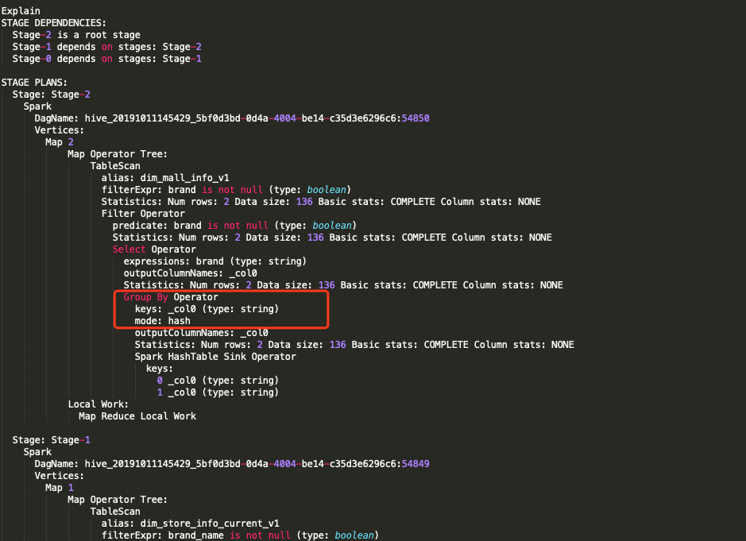

# left semi join和join实现子查询性能对比

- left semi join

**hive从[ 0.13](https://issues.apache.org/jira/browse/HIVE-784) 版本实现了in/exist自查询，实现方式是通过left semi join，left semi jion具体实现是在右表（子查询）中先对on的关键字做group by ，然后再做join操作**

```sql
select a.*
from
(
select brand,store_id
from dw.dim_store_info_current
) a 
left semi join
(
select brand
from dw.dim_brand_business_info_current
) b 
on a.brand=b.brand
```

下图为explain的截图，**因为多了一步group by,所以当子查询的表重复记录较少的情况下，用join实现子查询性能更高**

