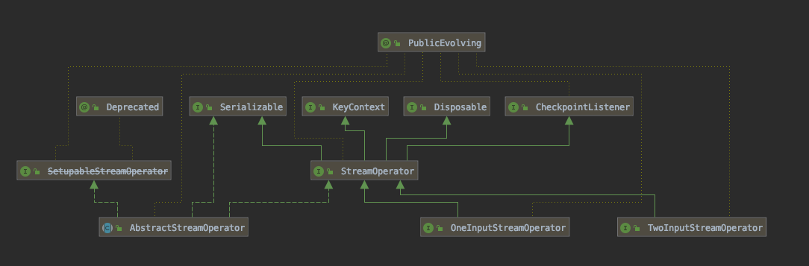
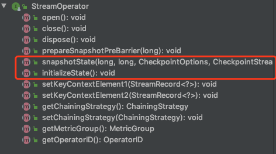
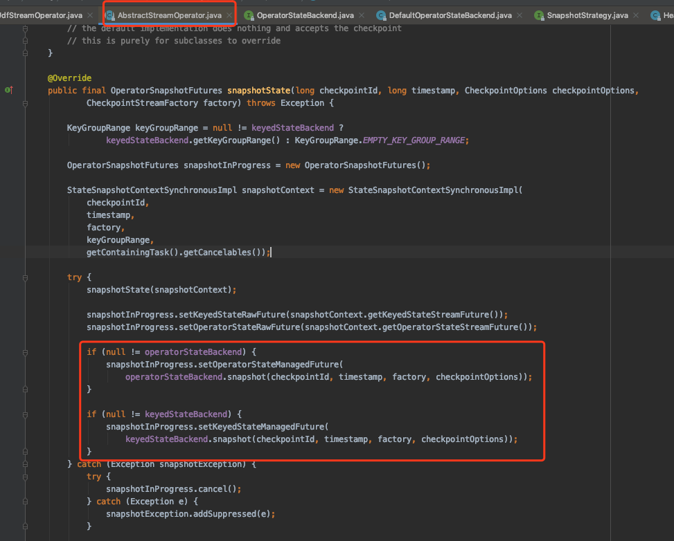

# operator state的产生和存储

**以下内容基于1.9.0版本**

flink的流处理过程是由operator连接起来的，operator的继承关系图如下，基类为StreamOperator,三个子类为OneInputOperator、TwoInputStreamOperator、AbstractStreamOperator

在StreamOperator类中定义了初始化state和保存state的方法，如下图

如果一个自定义的Operator想要实现state存储，就需要实现initializeState和snapshotState方法(如果不实现这两个方法，那么这个operator的操作将无状态，一个task挂掉了，内存中的状态将会丢失)，snapshotState方法的作用是存储state,以AbstractStreamOperator的snapshotState方法为例，

可以看到Operator调用Backend类的snapshot方法来保存state.

